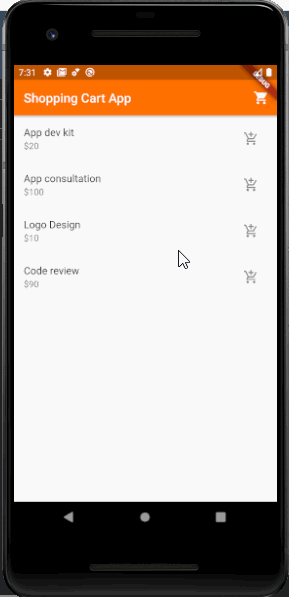

# Shopping-Cart-App

Shopping cart app is an app which illustrates how the BloC pattern can be used to build reactive apps.

## Preview
<center>



</center>

## Installation

Clone or download the project

### Cloning

```bash
git clone https://github.com/Vicradon/shoping-cart-app.git
flutter run
```
### Downloading

1. Download as zip
2. Open up the unzipped folder
3. run `flutter run` in your terminal

OR

1. Download as zip
2. Copy the content of the lib folder and pubspec.yaml into your existing project

## Usage
Play around with the code in your favorite emulator. You can read my tutorial on how to build this app on [dev](https://dev.to/vicradon)


## Contributing
Pull requests are welcome. For major changes, please open an issue first to discuss what you would like to change.


## License
[MIT](https://choosealicense.com/licenses/mit/)
